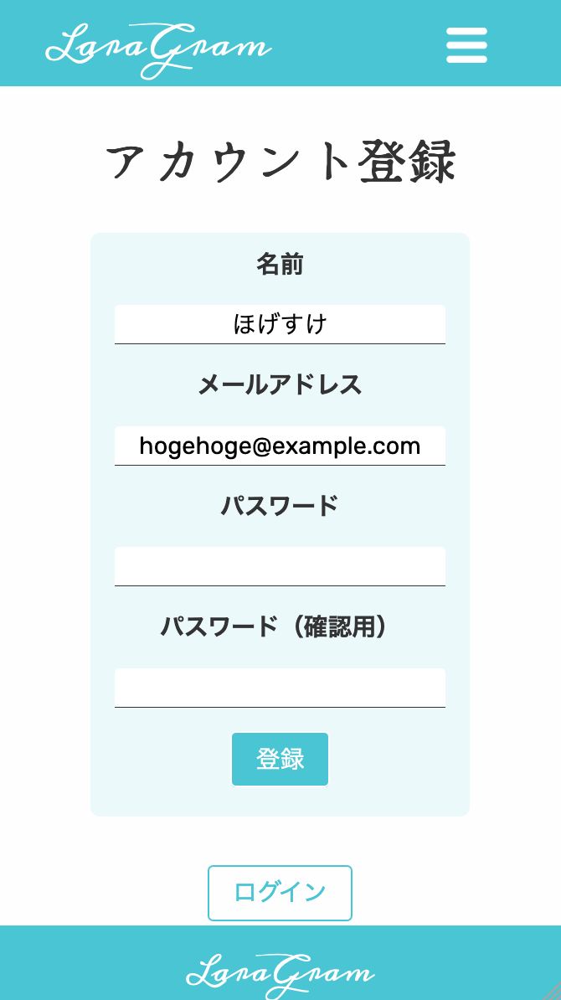
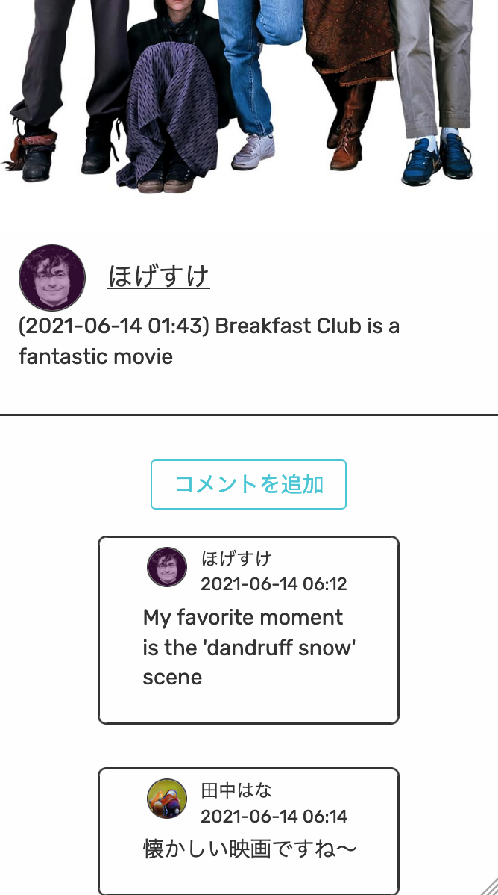

# Laragram
[](https://travis-ci.com/AnonZebra/laragram.svg?branch=main)

Developer: Lowe Wilsson

This is a Laravel-based full stack framework project, which allows users to register accounts, post photos, and comment on others' photos. It was created for the MVC course at Blekinge Institute of Technology.

## Pre-requirements
This project requires:
* PHP version >=7.4
* Composer

## Installation
Create a .env file and configure it, in accordance with your database and environment in general, as necessary for your project. You can copy the '.env.example' file to use as a starting point if you wish. The most important settings are the ones relating to your database. The example file assumes that you are using postgresql, but the project has been tested on and works with MySQL/MariaDB as well. If you do want to use MySQL/MariaDB, simply replace the `DB_CONNECTION` and `DB_PORT` values.

It is recommended that you also configure the '.env.testing' file, for enabling running tests on your own setup (with `php artisan test`).

Once you have set up your .env file, `cd` to the project root directory and run the following commands:
```
$ composer install --no-interaction
$ php artisan storage:link
$ php artisan migrate --force -vvv
$ php artisan migrate --env=testing --force -vvv
$ php artisan db:seed
```

## Permissions
Note that since media files are handled directly by the application, the web server user (eg Apache's '_www' user), or that user's group, needs read/write permission for the storage directory. For the same reason, the user running `php artisan test` __also__ needs storage read/write permission, since Laravel's storage-related mocking creates temporary files in the storage directory.

## Deployment
Once you've installed, got your database running, and made sure that permissions are correctly set, you need to serve the 'public' directory's 'index.php' file with whatever web server (Apache, Nginx etc.) you choose.

## Features
The app allows users to register and login. E-mails are used as unique user identifiers.

<div align="middle"></img></div>

Once logged in, users can set a profile image and description, though currently the description is only visible to the users themselves. They can also upload photos to their own 'photo blog'.

Guests and users can currently only explore other users' photos through a 'new users' view, where the 20 most recently registered users are displayed. If the app is developed further, user/blog search functionality will be added.

Registered users may comment on photos. It is currently not possible to reply to comments.

<div align="middle"></img></div>

The app supports Japanese (set as default), English and Swedish language settings. This can be toggled with a submenu in the header (or the 'sidebar', if viewing the app on a device with a smaller screen).

## Credits
A large part of the app's login functionality is based on a [YouTube tutorial series by Fuku/渋谷で働くエンジニア福](https://www.youtube.com/watch?v=t5PPCfcpq4A&list=PLCyDm9NTxdhLV5LFfCoRykyHW8Zw91YJB).